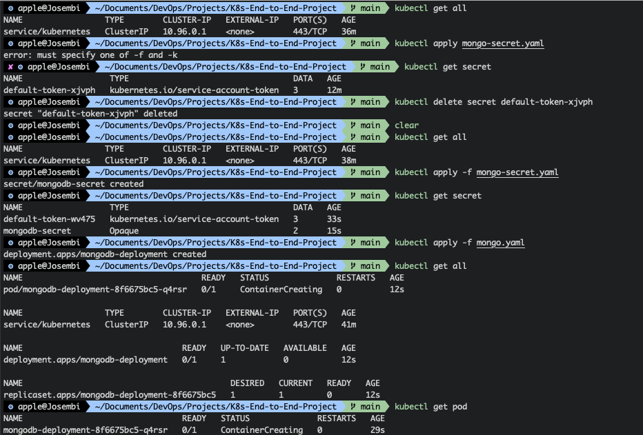
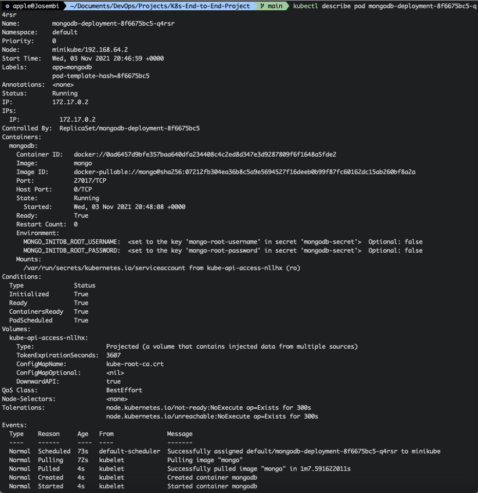
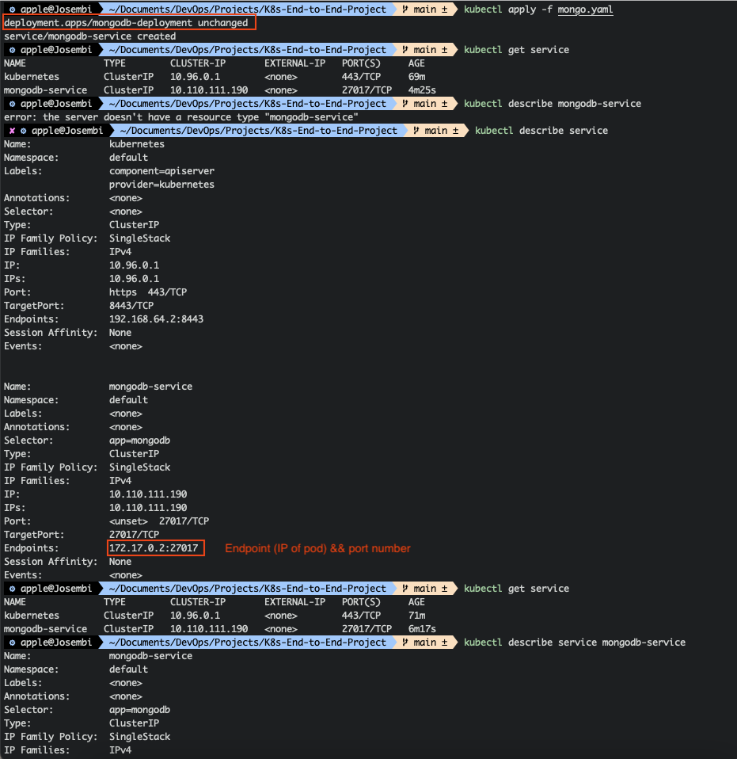
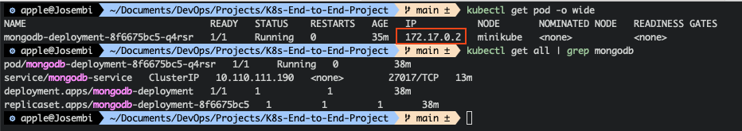
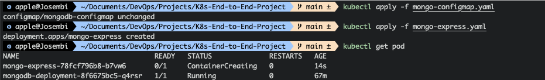
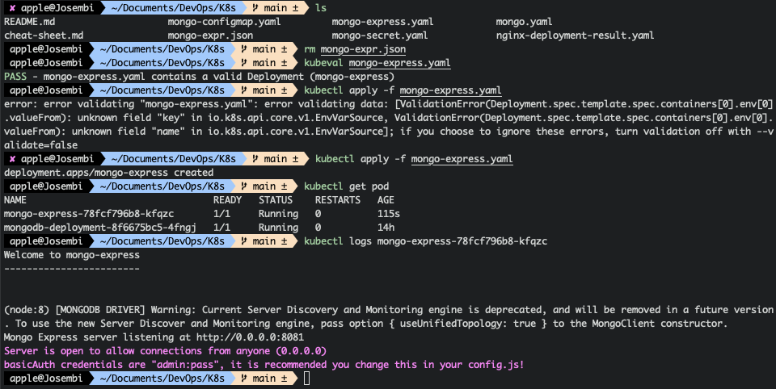
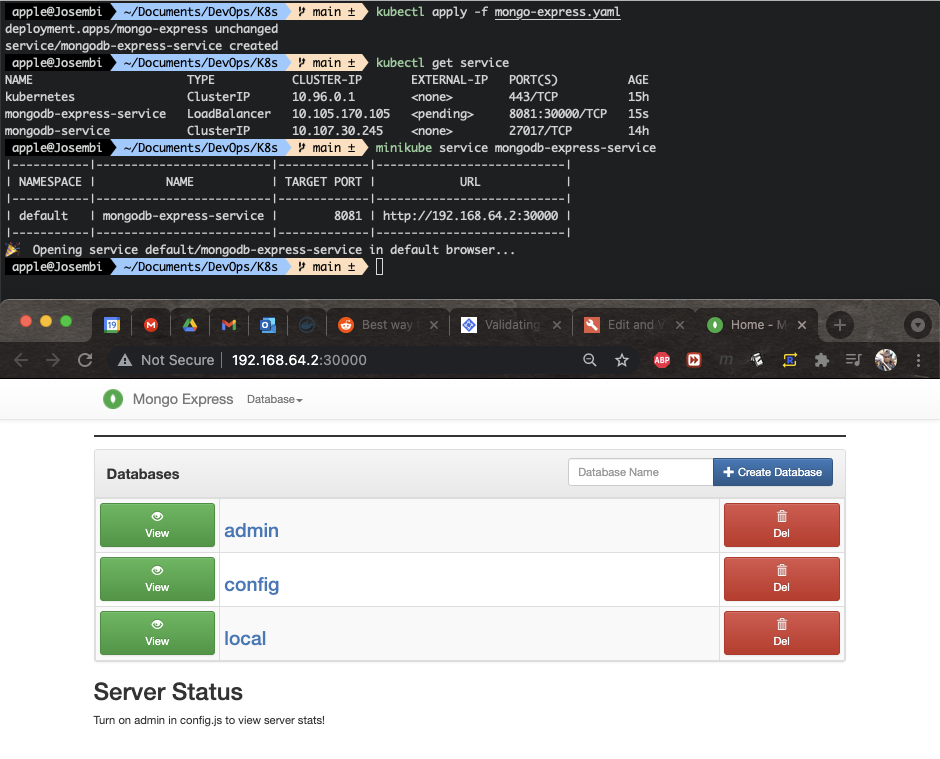
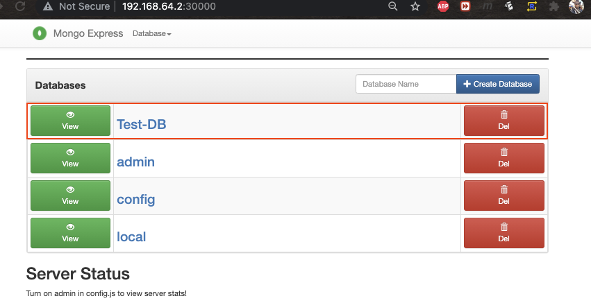
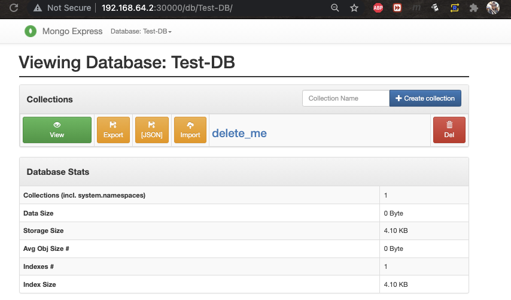

<p float="left">
  
  
  
</p>

----

# End-to-End Application Deployment with Kubernetes

## Introduction

In this project, I will be deploying an end-to-end mongo-express and mongoDB applications using Kubernates (K8s). This project mimics a production environment where a web tier (mongo-express) uses CRUD to manage objects in a database tier (MongoDB). I did create a similar project with an app-tier using Docker containers, you can check out the [Docker repo](https://github.com/appwebtech/Docker) and scroll down to "Developing with Docker". Mongo Express is a lightweight web-based administrative UI used to manage MongoDB databases interactively. It's designed using Express JS, Twitter Bootstrap and Node.js technologies.

## Tech Stack Architecture

I will need two pods to house the two applications (MongoDB pod and Mongo Express pod). MongoDB pod will use an **Internal Service** whilst Mongo Express will need an **External Service**. Both will be deployed using descriptor YAML files. Later I'll create a **ConfigMap** which will house the *DB url* and I'll also create a **Secret** which will house the *DB User* and *DB Password*.

### Browser Request Flow

1. Client inputs data in **Mongo Express UI**
2. **Mongo Express External Service** relays request to **Mongo Express Pod**
3. **Mongo Express Pod** relays requests to **MongoDB Internal Service**
4. **MongoDB Internal Service** relays request to **MongoDB Pod**
5. **MongoDB Pod** authenticates request via **Secret**

### MongoDB Deployment & Service

I've prepared the descriptor YAML file which I'll use for the deployment.

```yaml
apiVersion: apps/v1
kind: Deployment
metadata:
  name: mongodb-deployment
  labels:
    app: mongodb
spec:
  replicas: 1
  selector:
    matchLabels:
        app: mongodb
  template:
    metadata:
      labels:
        app: mongodb
    spec:
      containers:
      - name: mongodb
        image: mongo
        ports:
        - containerPort: 27017
        env:
        - name: MONGO_INITDB_ROOT_USERNAME
          valueFrom:
            secretKeyRef:
                name: mongodb-secret
                key: mongo-root-username
        - name: MONGO_INITDB_ROOT_PASSWORD
          valueFrom:
              secretKeyRef:
                name: mongodb-secret
                key: mongo-root-password
```

Before creating the deployment, Ill create the secret but instead of hard-coding the values of the username and password, I have encrypted them in base64 using my terminal and added the hashes in my secret file.

```yaml 
apiVersion: v1
kind: Secret
metadata:
  name: mongodb-secret
type: Opaque
data:
    mongo-root-username: am9zZW1iaQ==
    mongo-root-password: Y2F0aGVkcmFs
```

In bash, I'll apply the secret descriptor file and subsequently the mongo descriptor as well. See below the container is in **creating** phase. 



We can actually describe the pod and see what is happening under the hood. Mongo image is still getting pulled from dockerhub...



### MongoDB Internal Service

It's time to create the internal service for MongoDB to enable requests to and from Mongo by other services. I'll amalgamate the **Service** descriptor file with the mongo deployment because mongo is a dependency of the service without which it won't relay requests to Mongo Express and by the way that's how [kubernates](https://kubernetes.io/) creates them.

```yaml
---
apiVersion: v1
kind: Service
metadata:
  name: mongodb-service
spec:
  selector:
    app: mongodb
  ports:
    - protocol: TCP
      port: 27017
      targetPort: 27017
```

<details>
  <summary>Click to View Complete File</summary>
  
  ### Console Output
```yaml
apiVersion: apps/v1
kind: Deployment
metadata:
  name: mongodb-deployment
  labels:
    app: mongodb
spec:
  replicas: 1
  selector:
    matchLabels:
        app: mongodb
  template:
    metadata:
      labels:
        app: mongodb
    spec:
      containers:
      - name: mongodb
        image: mongo
        ports:
        - containerPort: 27017
        env:
        - name: MONGO_INITDB_ROOT_USERNAME
          valueFrom:
            secretKeyRef:
                name: mongodb-secret
                key: mongo-root-username
        - name: MONGO_INITDB_ROOT_PASSWORD
          valueFrom:
              secretKeyRef:
                name: mongodb-secret
                key: mongo-root-password
---
apiVersion: v1
kind: Service
metadata:
  name: mongodb-service
spec:
  selector:
    app: mongodb
  ports:
    - protocol: TCP
      port: 27017
      targetPort: 27017

```
</details>

Upon applying the descriptor yaml file, the *mongodb-deployment* will remain unchanged as I had run it previously. K8s is **idempotent** or smart enough to know I applied the configuration previously so it won't apply it again.





## MongoExpress Deployment, Service & ConfigMap

With the same methodology I used previously, I have created the **mongo-express.yaml** descriptor file which I shall apply using kubectl and add the **service** which shall be accessible externally at port 8081 via HTTP protocol. The environment variables to configure the descriptor are available in [dockerhub](https://hub.docker.com/_/mongo-express) for mongo-express and [here](https://hub.docker.com/_/mongo) for mongodb, it's a matter of *copy-paste* if you want to avoid typos and know what you are doing.

```yaml
apiVersion: apps/v1
kind: Deployment
metadata:
  name: mongo-express
  labels:
    app: mongo-express
spec:
  replicas: 1
  selector:
    matchLabels:
        app: mongo-express
  template:
    metadata:
      labels:
        app: mongo-express
    spec:
      containers:
      - name: mongo-express
        image: mongo-express
        ports:
        - containerPort: 8081
        env:
        - name: ME_CONFIG_MONGODB_ADMINUSERNAME
          valueFrom:
            secretKeyRef:
              name: mongodb-secret
              key: mongo-root-username
        - name: ME_CONFIG_MONGODB_ADMINPASSWORD
          valueFrom:
              secretKeyRef:
                name: mongodb-secret
                key: mongo-root-password
        - name: ME_CONFIG_MONGODB_SERVER
          valueFrom:
            configMapKeyRef:                    # Referenced configMap
              name: mongodb-configmap
              key: database_url
```

I have re-used the username and password that I used in mongodb, next thing to do now is create the **ConfigMap** which I'll outline below, which has more or less the same construct as **Secret**. The order of execution matters. I need the **ConfigMap** ready prior to execution of service in order to reference it (See comment on code above for the reference).

```yaml
apiVersion: v1
kind: ConfigMap
metadata:
  name: mongodb-configmap
data:
  database_url: mongodb-service
```



In order to access mongo-express on browser I'll deploy the external service (see below) by adding it to the mongo-express.yaml descriptor. I have exposed the *service port* as **8081** and the *target port* of **8081** is where the container is listening; the **type** of **LoadBalancer** is what makes it an external service which might be confusing for cloud engineers as there are various types of load balancers which can be **internal** or **external**.

Again the internal service in K8s distributes traffic load acting as a load balancer itself although not been labeled explicitly with the name of **LoadBalancer** because it doesn't assign external IP to Pods. Supposing you want to get to the airport very fast and you ask your friend to get you a cab. Instead s/he gets you an Uber. See? different names, same functions but one with a limited capability of accepting only cashless payments.

The nodeport is where the external IP will be open.

```yaml
apiVersion: v1
kind: Service
metadata:
  name: mongodb-express-service
spec:
  selector:
    app: mongo-express
  type: LoadBalancer
  ports:
    - protocol: TCP
      port: 8081
      targetPort: 8081
      nodePort: 30000
```

I have applied mongo-express deployment descriptor yaml file and it's up and running. If I get the mongo-express logs I can see the server is open to allow connections from anywhere.



<details>
  <summary>Click to View Complete File</summary>
  
  ### Console Output
```yaml
apiVersion: apps/v1
kind: Deployment
metadata:
  name: mongo-express
  labels:
    app: mongo-express
spec:
  replicas: 1
  selector:
    matchLabels:
        app: mongo-express
  template:
    metadata:
      labels:
        app: mongo-express
    spec:
      containers:
      - name: mongo-express
        image: mongo-express
        ports:
        - containerPort: 8081
        env:
        - name: ME_CONFIG_MONGODB_ADMINUSERNAME
          valueFrom:
            secretKeyRef:
              name: mongodb-secret
              key: mongo-root-username
        - name: ME_CONFIG_MONGODB_ADMINPASSWORD
          valueFrom:
              secretKeyRef:
                name: mongodb-secret
                key: mongo-root-password
        - name: ME_CONFIG_MONGODB_SERVER
          valueFrom:
            configMapKeyRef:
              name: mongodb-configmap
              key: database_url
---
apiVersion: v1
kind: Service
metadata:
  name: mongodb-express-service
spec:
  selector:
    app: mongo-express
  type: LoadBalancer
  ports:
    - protocol: TCP
      port: 8081
      targetPort: 8081
      nodePort: 30000
```
</details>

After instantiating the service, I launched the browser using **minikube**, which assigned a service to mongo-express and launched it using the default systems.



Poking things around to create a **Test-DB** database.



The following happened in the split of a second whilst creating the DB.

* Browser send request to Mongo Express External Service

* Mongo Express External Service forwarded the request to Mongo Express Pod

* Mongo Express Pod forwarded the request to MongoDB Internal Service

* MongoDB Internal Service forwarded the request to MongoDB Pod

Viewing the **Test-DB** database table.


